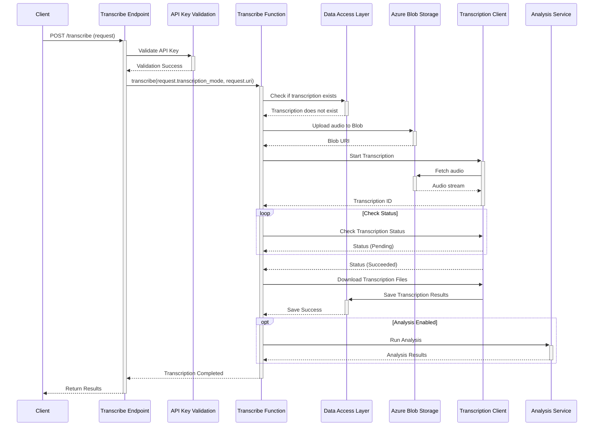
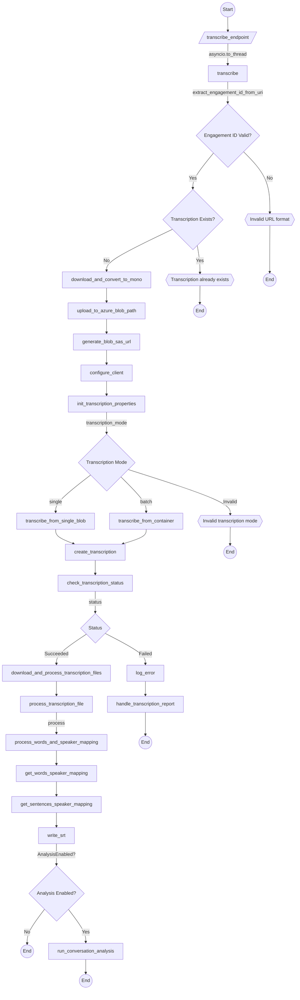
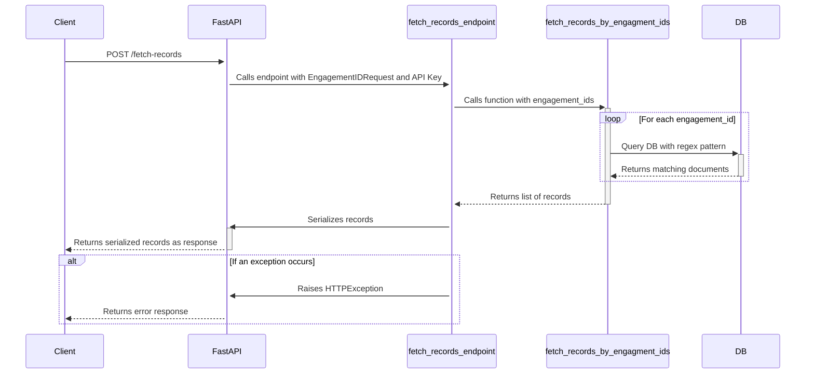
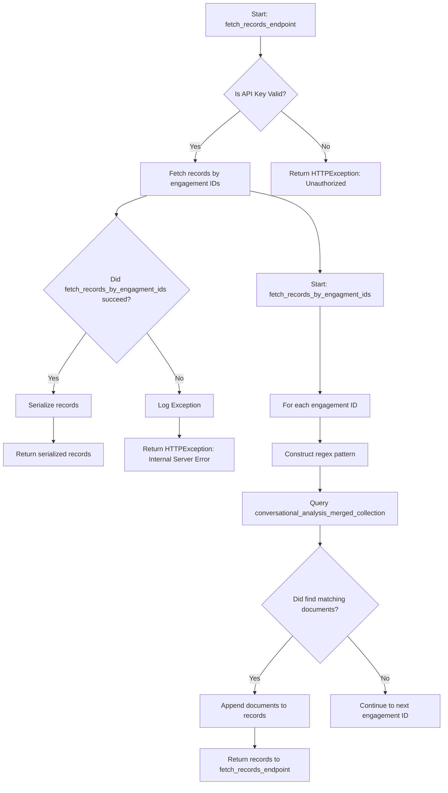

# aces-bvr-transcription-api

## Transcribe Endpoint

The Transcribe Endpoint is a crucial part of our audio processing service, designed to convert audio recordings into written transcripts. This document provides a comprehensive overview of the endpoint, including its functionality, implementation details, and how to use it.

### Endpoint Description

`POST /transcribe`

This endpoint accepts an audio file and transcription settings, processes the audio to generate a transcript, and returns the results in a structured format.

### Request Parameters

- `request`: A `TranscriptionRequest` object containing:
  - `transcription_mode`: Specifies the mode of transcription. Valid options are "single" for individual files or "batch" for processing multiple files.
  - `uri`: The URI of the audio file to be transcribed.
- `api_key`: Authentication API key required for accessing the endpoint. This is validated through a dependency, `get_api_key`.

### Response Format

The endpoint returns a JSON object with the following key:
- `Results`: Contains the transcription results. The structure of this object depends on the transcription mode and the content of the audio file.

### Error Handling

If an error occurs during the processing, the endpoint raises an `HTTPException` with status code 500 and a detailed error message.

### Implementation Details

#### Overview

The transcribe endpoint leverages asynchronous Python features (`asyncio`) to offload the transcription task to a separate thread, ensuring non-blocking behavior of the web service.

#### Core Components

- **Transcription Service**: The core logic for audio transcription is encapsulated in the `/utils/transcript_service.py` module. This includes audio file management, interaction with Azure Cognitive Services for speech-to-text conversion, and post-processing of transcription results.

- **Swagger Client Configuration**: Uses a swagger client to interact with Azure's Speech to Text API, configured with subscription keys and service regions from environment variables.

- **Transcription Properties**: Defines properties for the transcription request, such as diarization, punctuation mode, and profanity filter settings.

- **Audio Processing**: Includes downloading the audio file, converting it to mono (if necessary), uploading it to Azure Blob Storage, and generating a SAS token for secure access.

- **Database Interaction**: Utilizes data access objects (DAOs) for storing and retrieving transcription results and reports from the database.

### Using the Endpoint

1. **Authentication**: Ensure you have a valid API key for authentication.
2. **Prepare Request**: Formulate a `TranscriptionRequest` with the appropriate `transcription_mode` and the audio file's `uri`.
3. **Call Endpoint**: Use an HTTP client to `POST` the request to `/transcribe` along with the `api_key`.
4. **Handle Response**: Process the JSON response, which includes the transcription results or an error message if applicable.

### Error Codes

- `500 Internal Server Error`: Indicates an unexpected error occurred during the transcription process. Check the error message for more details.

### Sequence Diagram

### Flowchart Diagram

## Fetch Records Endpoint

The Fetch Records Endpoint is designed to retrieve conversational records based on engagement IDs. This document provides details about the endpoint's functionality, how it's implemented, and instructions for use.

### Endpoint Description

`POST /fetch-records`

This endpoint accepts a list of engagement IDs and returns the conversational records associated with those IDs.

### Request Parameters

- `request`: An `EngagementIDRequest` object containing:
  - `engagement_ids`: A list of engagement IDs for which records are to be fetched.
- `api_key`: An authentication API key required for accessing the endpoint. This is validated through a dependency, `get_api_key`.

### Response Format

The endpoint returns a list of dictionaries, each representing a conversational record associated with the provided engagement IDs. The structure of these dictionaries is defined by the data model in the conversational analysis database.

### Error Handling

If an error occurs during the process, the endpoint raises an `HTTPException` with status code 500 and a detailed error message.

### Implementation Details

#### Overview

The fetch records endpoint uses the `fetch_records_by_engagment_ids` function from the `utils.db_helpers` module to query the database for records matching the provided engagement IDs.

#### Core Components

- **Database Query**: The `fetch_records_by_engagment_ids` function constructs a regex pattern based on the engagement IDs and queries the `conversational_analysis_merged_collection` for matching documents.

- **Serialization**: Utilizes the `custom_jsonable_encoder` from `utils.helper` to serialize the MongoDB documents into JSON-compatible format.

### Using the Endpoint

1. **Authentication**: Ensure you have a valid API key for authentication.
2. **Prepare Request**: Create an `EngagementIDRequest` object with the list of engagement IDs for which you want to fetch records.
3. **Call Endpoint**: Use an HTTP client to `POST` the request to `/fetch-records` along with the `api_key`.
4. **Handle Response**: Process the response, which contains a list of dictionaries with the conversational records.

### Sequence Diagram

### Flowchart Diagram

### Error Codes

- `500 Internal Server Error`: Indicates an unexpected error occurred during the fetching process. Check the error message for more details.

### Development and Testing

- **Environment Setup**: Ensure all required environment variables are set, including `SUBSCRIPTION_KEY`, `SERVICE_REGION`, and Azure Blob Storage settings.
- **Dependencies**: Install all necessary Python packages as listed in `requirements.txt`.

